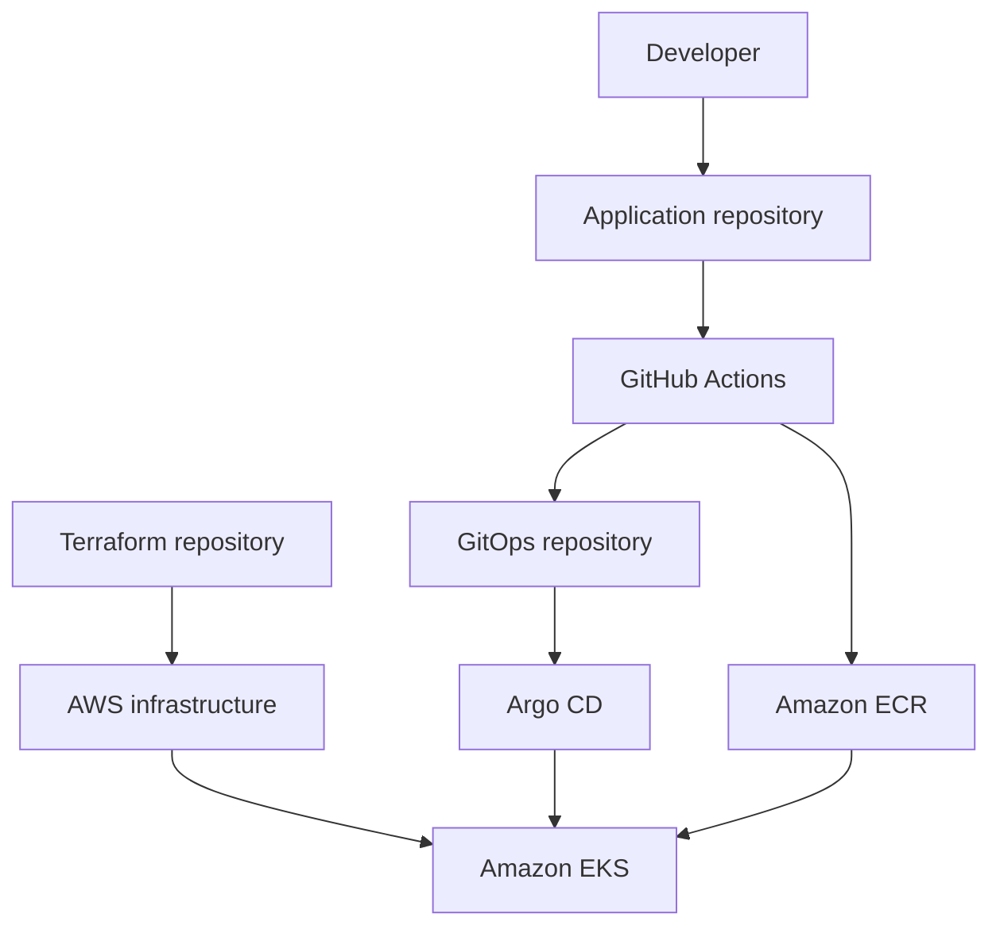

# Amazon EKS GitOps Platform with Terraform

[](https://github.com/TechWorld707/terraform-aws-eks-gitops-platform/actions/workflows/terraform-pr.yml)

A production-oriented Amazon EKS platform provisioned with Terraform and designed for secure, automated application delivery through GitHub Actions and Argo CD.

This project demonstrates Kubernetes platform engineering, infrastructure as code, GitOps delivery, AWS identity management, container security, observability, software supply-chain controls, and automated rollback.

## Platform overview

The solution is separated into three repositories to establish clear ownership boundaries between infrastructure, application source code, and deployment configuration.

| Repository | Responsibility |
| --- | --- |
| [`terraform-aws-eks-gitops-platform`](https://github.com/TechWorld707/terraform-aws-eks-gitops-platform) | Provisions the AWS infrastructure, EKS cluster, ECR repositories, identity controls, and initial platform add-ons |
| [`three-tier-eks-application`](https://github.com/TechWorld707/three-tier-eks-application) | Contains the frontend and API source code, tests, and container build definitions |
| [`three-tier-eks-gitops`](https://github.com/TechWorld707/three-tier-eks-gitops) | Defines the desired Kubernetes and Helm configuration continuously reconciled by Argo CD |

## Delivery architecture



The application pipeline builds and validates container images before publishing them to Amazon ECR. Deployment state is stored separately in the GitOps repository and continuously reconciled with the EKS cluster by Argo CD.

## Architecture ownership

### Terraform-managed infrastructure

Terraform provisions and manages:

- VPC
- Public and private subnets
- Routing and NAT gateways
- VPC endpoints
- Amazon EKS control plane
- EKS managed node groups
- Amazon ECR repositories
- AWS KMS keys
- IAM roles and policies
- AWS-managed EKS add-ons
- Initial platform bootstrap

### Platform add-ons

A separate Terraform state installs the initial platform services:

- Argo CD
- AWS Load Balancer Controller
- ExternalDNS
- External Secrets Operator
- Metrics Server
- Required Kubernetes namespaces
- Autoscaling prerequisites

### GitOps-managed resources

After Argo CD is operational, the GitOps repository manages:

- Frontend workloads
- API workloads
- Kubernetes Services
- Ingress resources
- ConfigMaps
- Horizontal Pod Autoscalers
- NetworkPolicies
- Application image digests
- Application updates and rollbacks

## State separation

The development environment uses two independent Terraform roots:

```text
environments/dev/foundation
environments/dev/addons
```

### Foundation state

The foundation state owns AWS infrastructure and the EKS cluster.

```text
VPC
├── Public subnets
├── Private subnets
├── NAT gateways
└── VPC endpoints

Amazon EKS
├── Control plane
├── Managed node groups
├── IAM roles and policies
├── KMS encryption
└── AWS-managed add-ons

Amazon ECR
└── Application repositories
```

### Add-ons state

The add-ons state owns the Kubernetes platform services required before application delivery begins.

Separating the states provides:

- A clear dependency boundary
- Smaller Terraform plans
- Reduced infrastructure blast radius
- Independent platform add-on updates
- Easier troubleshooting and recovery
- Safer destruction ordering

## Repository structure

```text
.
├── .github/
│   └── workflows/          # Infrastructure validation workflows
├── bootstrap/              # Initial platform bootstrap configuration
├── docs/
│   └── architecture/       # Architecture documentation and diagrams
├── environments/
│   └── dev/
│       ├── foundation/     # AWS and EKS infrastructure root
│       └── addons/         # Kubernetes platform add-ons root
├── modules/                # Reusable Terraform modules
├── .gitignore
└── README.md
```

## Key engineering decisions

### Separate infrastructure and application ownership

Infrastructure, application code, and deployment configuration are stored in different repositories. This reduces coupling and models the ownership boundaries commonly used by platform and application teams.

### Separate Terraform states

Foundation infrastructure and Kubernetes add-ons use separate states. Add-ons depend on outputs from the foundation layer, while changes to platform services do not require replanning the entire AWS environment.

### GitOps as the deployment control plane

Argo CD continuously compares the desired configuration in Git with the running Kubernetes environment. Git history provides an auditable record of application configuration changes and enables rollback to a previous known state.

### Immutable image references

Application deployments should reference container image digests rather than mutable tags. This ensures that the deployed image is the exact image validated and published by the CI pipeline.

## Security controls

The platform is designed around layered security controls:

- Kubernetes worker nodes run in private subnets
- AWS resources use IAM roles and scoped policies
- Amazon ECR stores application container images
- AWS KMS protects supported encrypted resources
- Kubernetes NetworkPolicies restrict workload communication
- External Secrets Operator integrates application secrets with an external secret store
- GitHub Actions provides automated infrastructure and application validation
- GitOps keeps deployment changes reviewable and auditable
- Image digests provide immutable deployment references

Security controls should be reviewed and adapted before using the platform for real production workloads.

## Prerequisites

Before deploying the platform, install and configure:

- An AWS account
- AWS CLI
- Terraform
- `kubectl`
- Helm
- Git
- Appropriate AWS permissions
- An S3 backend and locking mechanism if remote Terraform state is enabled

Confirm your AWS identity:

```bash
aws sts get-caller-identity
```

Confirm the required tools are available:

```bash
terraform version
kubectl version --client
helm version
aws --version
```

## Deployment

> AWS infrastructure can incur charges. Review the planned resources and expected costs before applying Terraform.

### 1. Clone the repository

```bash
git clone https://github.com/TechWorld707/terraform-aws-eks-gitops-platform.git
cd terraform-aws-eks-gitops-platform
```

### 2. Configure AWS authentication

Configure the AWS CLI using your preferred authentication method.

```bash
aws configure
```

Alternatively, use an existing AWS profile:

```bash
export AWS_PROFILE="your-profile"
```

### 3. Review the development configuration

Inspect the variables and backend configuration under:

```text
environments/dev/foundation
environments/dev/addons
```

Do not commit credentials, private keys, Terraform state files, or secret values to Git.

### 4. Deploy the foundation

```bash
cd environments/dev/foundation

terraform init
terraform fmt -check
terraform validate
terraform plan
terraform apply
```

Review the plan carefully before approving the apply operation.

### 5. Configure Kubernetes access

After the EKS cluster is available, update your local kubeconfig:

```bash
aws eks update-kubeconfig \
  --region YOUR_AWS_REGION \
  --name YOUR_EKS_CLUSTER_NAME
```

Validate cluster access:

```bash
kubectl get nodes
kubectl get pods --all-namespaces
```

### 6. Deploy platform add-ons

From the repository root:

```bash
cd environments/dev/addons

terraform init
terraform fmt -check
terraform validate
terraform plan
terraform apply
```

### 7. Validate Argo CD

```bash
kubectl get pods -n argocd
kubectl get applications -n argocd
```

All required Argo CD components should reach a healthy running state before application deployment.

## Validation

### Terraform validation

Run formatting and validation from each Terraform root:

```bash
terraform fmt -check -recursive
terraform validate
```

### Kubernetes validation

```bash
kubectl get nodes
kubectl get pods --all-namespaces
kubectl get ingress --all-namespaces
kubectl get hpa --all-namespaces
kubectl get networkpolicy --all-namespaces
```

### Argo CD validation

```bash
kubectl get applications -n argocd
```

Confirm that applications report the expected synchronization and health status.

## Delivery workflow

The intended delivery flow is:

1. A developer changes application code.
2. A pull request triggers automated tests and validation.
3. The CI workflow builds the container image.
4. Security checks validate the image.
5. The image is pushed to Amazon ECR.
6. The GitOps repository is updated with the approved image digest.
7. Argo CD detects the desired-state change.
8. Argo CD synchronizes the application with Amazon EKS.
9. Kubernetes performs the configured rollout.
10. Git history provides a rollback point if required.

## Rollback approach

Application rollback is performed through Git rather than by making an undocumented change directly in the cluster.

A previous known-good image digest or configuration can be restored in the GitOps repository. Argo CD then reconciles the cluster back to that desired state.

Direct manual cluster changes should be reserved for diagnosis and emergencies because Argo CD may revert changes that are not represented in Git.

## Destruction

Destroy resources in reverse dependency order.

### 1. Remove GitOps-managed applications

Remove or disable the Argo CD applications and confirm that application load balancers and other dependent resources have been deleted.

### 2. Destroy platform add-ons

```bash
cd environments/dev/addons
terraform destroy
```

### 3. Destroy the foundation

```bash
cd ../foundation
terraform destroy
```

### 4. Verify cleanup

Check the AWS account for resources that may continue generating costs, including:

- Load balancers
- NAT gateways
- EBS volumes
- Elastic IP addresses
- ECR images
- Route 53 records
- CloudWatch log groups
- S3 state storage

## Cost considerations

The main potential cost drivers include:

- Amazon EKS cluster
- EC2 worker nodes
- NAT gateways
- Load balancers
- VPC endpoints
- EBS volumes
- CloudWatch logs
- Data transfer

This repository demonstrates production-oriented patterns, but the development environment should be reviewed and right-sized according to budget and workload requirements.

## Current scope

This project is a portfolio and engineering demonstration environment. It applies production-oriented design principles but should not be treated as a fully supported production service without further organizational controls.

Possible future improvements include:

- Multiple environments
- Automated disaster-recovery testing
- Policy-as-code enforcement
- Expanded observability dashboards
- Automated cost reporting
- Scheduled security scanning
- Load and resilience testing

## Related repositories

- [Application source code](https://github.com/TechWorld707/three-tier-eks-application)
- [GitOps configuration](https://github.com/TechWorld707/three-tier-eks-gitops)

## Author

**Henry — TechWorld707**

DevOps and Platform Engineer focused on AWS, Kubernetes, Terraform, Docker, Ansible, CI/CD, and GitOps.

- [GitHub profile](https://github.com/TechWorld707)
- [Email](mailto:hento77@yahoo.com)
